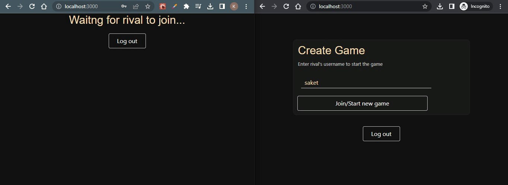

# tic-tac-toe :video_game:

<h2>How to play? </h2>

1) Register with a username

2) Enter username of your rival (person you want to play with)

3) Join/Start new game

<h2>Output</h2>

<h2>Commands</h2>
To start the server and client :  

### `npm start`

client running on: http://localhost:3000/

server running on: http://localhost:5000/
